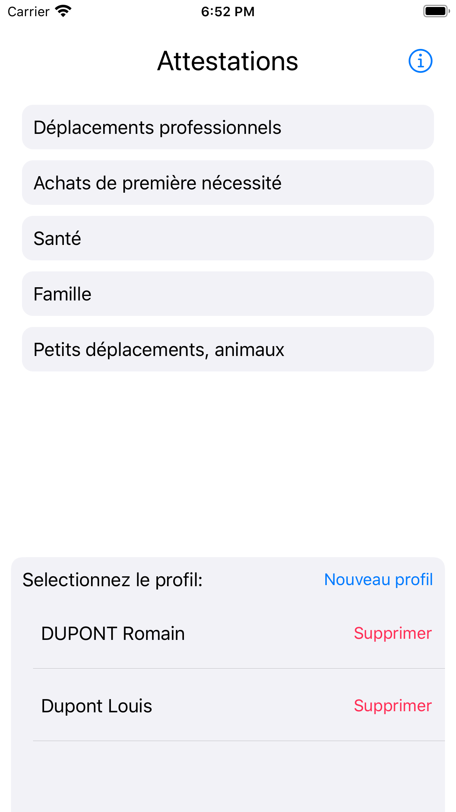
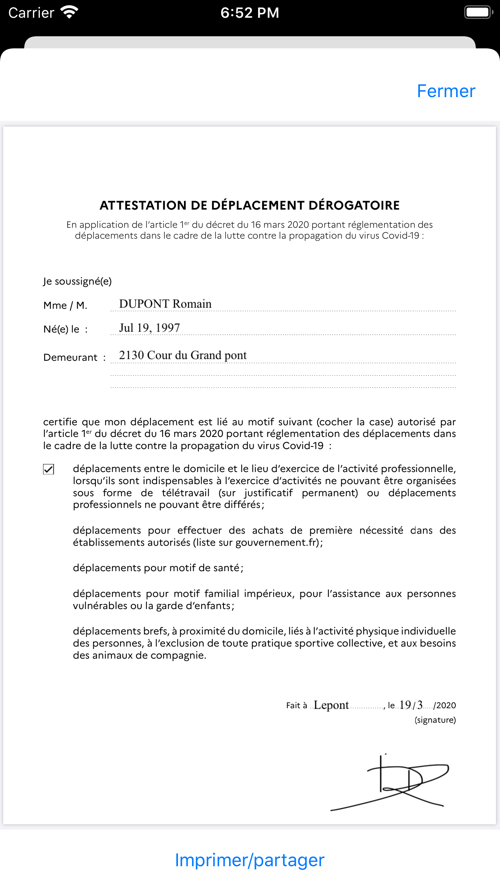

  

# Attest

Actualisez et imprimez vos attestations de circulation facilement! 
Créez vos profils une fois, puis générez vos attestations à la date du jour!

En accord avec la RGDP:

Vos données personnelles ne sont ni collectées, ni communiquées, ni stockées (autre que localement sur votre téléphone). Vous pouvez supprimer ces données de façon définitive en supprimant simplement l'application de votre téléphone. Le code source de cette application est consultable et vérifiable ici.

!!!!!!Attention!!!!!

Cette application existe pour faciliter l'impression de vos attestations. L'utiliser sans imprimer vos documents vous expose à une amende forfaitaire de 175 euros en cas de contrôle!

### Installing

Bientôt disponible sur l'appstore. En attente de validation ⏳ 
Vous pouvez également l'installer manuellement sur votre iPhone si vous avez un compte apple dévelopeur.
Depuis peu vous pouvez en ouvrir un gratuitement ici:
https://developer.apple.com/programs/

## Contributing

Cette application a été pensée/écrite en moins de 24h... 
Donc beaucoup de choses sont à améliorer tant au niveau design qu'au niveau code. 
Toute participation est la bienvenue!

## Privacy policies

Please refer to the privacy-policy.md file of this repo:
https://github.com/RomeHein/attest/blob/master/privacy-policy.md

## Authors

* **Romain Cayzac** - *Initial work* -

## License

This project is licensed under the MIT License
